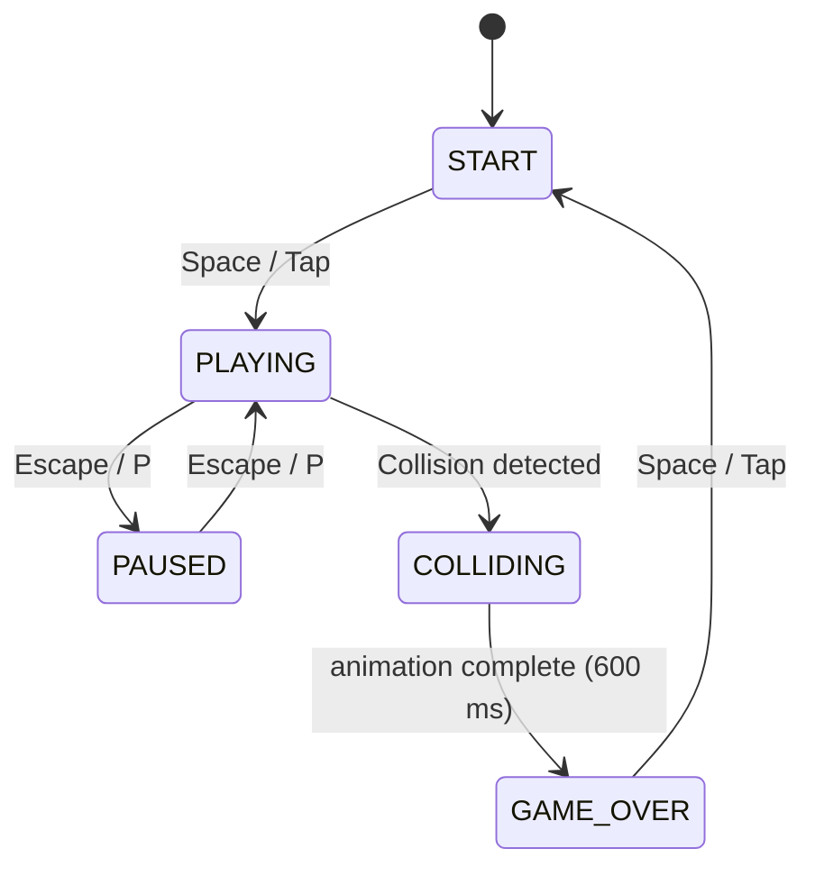

# Design Document: Flappy Kiro

## Overview

Flappy Kiro is a browser-based endless scroller game rendered entirely on an HTML5 Canvas using vanilla JavaScript. The player controls Ghosty, a ghost sprite, navigating through an infinite series of pipe obstacles. The game is delivered as a minimal set of static files (`index.html` + `assets/`) with no build step or server-side runtime.

The design centers on a deterministic game loop driven by `requestAnimationFrame`, a finite state machine governing game phases, a delta-time physics system for frame-rate independence, and a layered rendering pipeline that draws background → clouds → pipes → particles → Ghosty → UI → overlays in order.

Key design decisions:
- **No frameworks**: plain ES6 modules or a single script tag keeps the deliverable simple and portable.
- **Delta-time physics**: all velocities and positions are expressed in pixels/second so the game behaves identically at 30 fps and 144 fps.
- **Web Audio API with HTML `<audio>` fallback**: gives precise control over sound (looping, pause/resume position) while degrading gracefully.
- **Canvas-only rendering**: no DOM elements inside the game viewport; overlays (pause, game-over, start) are drawn directly onto the canvas.
- **External `config.json`**: all tunable constants are extracted into a separate `config.json` file loaded via `fetch()` at startup, keeping `game.js` free of magic numbers and making tuning straightforward without editing source code. A hardcoded default config in `game.js` ensures the game still works when served directly from the filesystem without an HTTP server.

---

## Architecture

### High-Level Structure

```
index.html
  └── <canvas id="gameCanvas">
  └── <script src="game.js" type="module">

config.json  (all tunable constants, loaded via fetch() at startup)

game.js  (entry point — loads config, wires everything together, owns the RAF loop)
  ├── StateMachine      (manages game phases)
  ├── PhysicsSystem     (gravity, velocity, position updates)
  ├── PipeManager       (spawn, scroll, recycle, speed ramp)
  ├── CloudManager      (parallax layers, wrap-around)
  ├── ParticleSystem    (trail emission, lifetime, fade)
  ├── CollisionSystem   (circle-vs-rect hitbox tests)
  ├── ScoreManager      (increment, high-score persistence)
  ├── AudioManager      (Web Audio API / HTML audio)
  ├── Renderer          (ordered draw calls each frame)
  └── InputHandler      (keyboard + touch, routed by state)

assets/
  ├── ghosty.png
  ├── jump.wav
  └── game_over.wav
```

### Game Loop

```
requestAnimationFrame(loop)
  │
  ├─ compute deltaTime = (now - lastTime) / 1000   // seconds
  ├─ clamp deltaTime to max 0.05 s                 // prevents spiral-of-death
  │
  ├─ StateMachine.update(deltaTime)
  │     ├─ PLAYING  → PhysicsSystem, PipeManager, CloudManager,
  │     │             ParticleSystem, CollisionSystem, ScoreManager
  │     ├─ PAUSED   → CloudManager only (optional; can freeze everything)
  │     ├─ COLLIDING→ CollisionAnimation timer, ScreenShake
  │     └─ START / GAME_OVER → idle
  │
  └─ Renderer.draw(state)
```

### State Machine



States:
| State | Description |
|---|---|
| `START` | Start screen; no physics; awaiting first input |
| `PLAYING` | Full game loop active; collision detection enabled after invincibility window |
| `PAUSED` | All updates frozen; pause overlay rendered |
| `COLLIDING` | Ghosty flash animation + screen shake; pipes frozen |
| `GAME_OVER` | Game-over screen; awaiting restart input |

---

## Components and Interfaces

### StateMachine

```js
class StateMachine {
  state: 'START' | 'PLAYING' | 'PAUSED' | 'COLLIDING' | 'GAME_OVER'
  transition(newState): void
  update(dt): void   // delegates to active subsystems
}
```

### PhysicsSystem

Owns Ghosty's kinematic state.

```js
class PhysicsSystem {
  y: number          // Ghosty center Y (pixels)
  vy: number         // vertical velocity (px/s, positive = down)

  update(dt): void   // apply gravity, clamp to terminal velocity, integrate position
  jump(): void       // set vy = -ASCENT_VELOCITY
  reset(): void      // restore initial position and zero velocity
}
```

Constants (tunable):
```
GRAVITY           = 1800  px/s²
ASCENT_VELOCITY   = 520   px/s  (upward, so applied as negative vy)
TERMINAL_VELOCITY = 700   px/s  (downward)
GHOSTY_X          = 120   px    (fixed horizontal position)
GHOSTY_SIZE       = 48    px    (sprite render size)
HITBOX_INSET      = 8     px    (all sides)
```

### PipeManager

```js
class PipeManager {
  pipes: Pipe[]          // active pipe pairs
  speed: number          // current px/s

  update(dt): void       // scroll, spawn, recycle, speed ramp
  reset(): void
  checkScoring(ghostyX): number   // returns pipes newly passed
}

class Pipe {
  x: number
  gapTop: number         // Y of gap top edge
  gapBottom: number      // Y of gap bottom edge
  scored: boolean
}
```

Constants:
```
PIPE_WIDTH          = 64   px
PIPE_SPACING        = 280  px   (leading-edge to leading-edge)
GAP_SIZE            = 160  px
INITIAL_PIPE_SPEED  = 200  px/s
SPEED_INCREMENT     = 15   px/s
SPEED_MILESTONE     = 5    (every 5 points)
GAP_MARGIN          = 60   px   (min distance from canvas top/bottom)
```

### CloudManager

```js
class CloudManager {
  layers: CloudLayer[]   // two layers at different speeds

  update(dt): void       // scroll each layer, wrap clouds
  draw(ctx): void
}

class CloudLayer {
  speed: number          // px/s
  clouds: Cloud[]
}

class Cloud {
  x, y, width, height: number
  alpha: number          // 0.15–0.35
}
```

Layer speeds: `[40, 80]` px/s (back → front).

### ParticleSystem

```js
class ParticleSystem {
  particles: Particle[]

  emit(x, y): void       // called every PLAYING frame
  update(dt): void       // age particles, remove expired
  draw(ctx): void
}

class Particle {
  x, y: number
  vx, vy: number         // small random spread
  life: number           // 0–1, starts at 1
  maxLife: number        // ≤ 0.5 s
  color: string
}
```

### CollisionSystem

```js
class CollisionSystem {
  invincible: boolean
  invincibilityTimer: number   // counts down from 2.0 s

  update(dt): void
  getCircle(physicsY: number): { cx: number, cy: number, r: number }
  test(physicsY: number, pipes: Pipe[], canvasH: number): boolean
}
```

Circle derivation:
```
circle.cx = GHOSTY_X
circle.cy = physicsY
circle.r  = (GHOSTY_SIZE / 2) - HITBOX_INSET
```

Circle-vs-rect pipe test (applied to both top and bottom pipe rects):
```
clampedX = clamp(circle.cx, rect.x, rect.x + rect.w)
clampedY = clamp(circle.cy, rect.y, rect.y + rect.h)
dist     = sqrt((circle.cx - clampedX)² + (circle.cy - clampedY)²)
collision = dist < circle.r
```

Canvas boundary using circle:
```
ceiling: circle.cy - circle.r <= 0
ground:  circle.cy + circle.r >= canvasH
```

### ScoreManager

```js
class ScoreManager {
  score: number
  highScore: number

  increment(): void          // +1, persist if new high score, trigger pop
  loadHighScore(): void      // read from localStorage
  saveHighScore(): void      // write to localStorage
  reset(): void
}
```

localStorage key: `"flappyKiro_highScore"`.

### AudioManager

```js
class AudioManager {
  playJump(): void
  playGameOver(): void
  playScore(): void
  playMusic(): void          // loop background track
  pauseMusic(): void
  resumeMusic(): void
  stopMusic(): void
}
```

Implementation strategy:
- Prefer Web Audio API (`AudioContext`) for jump/score/game-over (allows rapid re-triggering by cloning `AudioBufferSourceNode`).
- Use an HTML `<audio>` element for background music (simplest loop + pause/resume).
- On first user interaction, resume `AudioContext` if suspended (autoplay policy).
- Score sound: a short synthesized blip generated via Web Audio API oscillator (no external asset needed).
- Background music: a short looping chiptune `.ogg`/`.mp3` asset included in `assets/`.

### Renderer

Draw order per frame:
1. Clear canvas
2. Background fill (solid retro color)
3. CloudManager.draw (back layer → front layer)
4. PipeManager.draw
5. ParticleSystem.draw
6. Ghosty sprite (with flash alpha during COLLIDING state)
7. Score display (with Score_Pop scale transform)
8. Screen shake offset applied via `ctx.save/translate/restore` wrapping steps 2–7
9. Scanline overlay (semi-transparent horizontal lines, drawn last, unaffected by shake)
10. State overlays: START / PAUSE / GAME_OVER panels

### InputHandler

```js
class InputHandler {
  onSpace(state): void    // routes to StateMachine
  onEscapeOrP(state): void
  onTap(state): void
}
```

Registered once; delegates action based on current `StateMachine.state`.

---

## Data Models

### config.json

All tunable constants are stored in `config.json` at the project root and loaded via `fetch()` before any subsystem is initialized. Values are grouped by concern:

```json
{
  "canvas": {
    "width": 480,
    "height": 640
  },
  "physics": {
    "gravity": 1800,
    "ascentVelocity": 520,
    "terminalVelocity": 700,
    "ghostyX": 120,
    "ghostySize": 48,
    "hitboxInset": 8      // pixels subtracted from sprite half-size to derive circle radius: r = ghostySize/2 - hitboxInset
  },
  "pipes": {
    "width": 64,
    "spacing": 280,
    "gapSize": 160,
    "gapMargin": 60,
    "initialSpeed": 200,
    "speedIncrement": 15,
    "speedMilestone": 5
  },
  "timing": {
    "invincibilitySecs": 2.0,
    "collisionAnimSecs": 0.6,
    "screenShakeSecs": 0.4,
    "screenShakeMag": 8,
    "particleLifetime": 0.4,
    "scorePopSecs": 0.3,
    "maxDeltaTime": 0.05
  },
  "clouds": [
    { "speed": 40, "count": 4 },
    { "speed": 80, "count": 3 }
  ],
  "audio": {
    "lsKey": "flappyKiro_highScore"
  }
}
```

### Config Loading

`game.js` loads `config.json` before initializing any subsystem:

```js
async function loadConfig() {
  try {
    const res = await fetch('config.json');
    if (!res.ok) throw new Error(`HTTP ${res.status}`);
    return await res.json();
  } catch (err) {
    console.warn('[FlappyKiro] Could not load config.json, using defaults.', err);
    return DEFAULT_CONFIG;   // hardcoded fallback defined inline in game.js
  }
}

const config = await loadConfig();
// All subsystems receive config via constructor injection — no global CONFIG object.
const physics   = new PhysicsSystem(config.physics);
const pipes     = new PipeManager(config.pipes, config.canvas);
const clouds    = new CloudManager(config.clouds, config.canvas);
// … etc.
```

Key rules:
- **Constructor injection**: every subsystem receives only the slice of `config` it needs; no subsystem reads a global constant.
- **Fallback**: `DEFAULT_CONFIG` is a plain object literal in `game.js` with the same shape as `config.json`. It is used automatically when `fetch` fails (e.g. `file://` protocol without a local server).
- **Console warning**: when falling back, a `console.warn` message is emitted so developers know the external file was not loaded.

> **Note — local HTTP server required for `fetch()`**: browsers block `fetch()` on `file://` URLs. To use `config.json`, serve the project with a local HTTP server:
> ```
> npx serve .
> # or use VS Code Live Server extension
> ```
> If you open `index.html` directly from the filesystem (double-click), `fetch` will fail and the game will automatically fall back to the hardcoded defaults in `game.js` — gameplay is unaffected, but any edits to `config.json` will be ignored until a server is used.

### Ghosty Collision Circle Derivation

`HITBOX_INSET` is used to shrink the collision circle relative to the sprite, giving a smaller, fairer hit region:

```
circle.cx = GHOSTY_X
circle.cy = physicsY
circle.r  = (GHOSTY_SIZE / 2) - HITBOX_INSET
```

### Pipe Bounds Derivation

```
topPipe    = { x: pipe.x, y: 0,            w: PIPE_WIDTH, h: pipe.gapTop }
bottomPipe = { x: pipe.x, y: pipe.gapBottom, w: PIPE_WIDTH, h: CANVAS_HEIGHT - pipe.gapBottom }
```

### Score Pop State

```js
{
  active: boolean,
  elapsed: number,   // seconds since pop started
  scale: number,     // computed each frame: 1 + sin(π * elapsed/SCORE_POP_SECS) * 0.5
}
```

### Screen Shake State

```js
{
  active: boolean,
  elapsed: number,
  offsetX: number,   // re-randomized each frame while active
  offsetY: number,
}
```

---

## Correctness Properties

*A property is a characteristic or behavior that should hold true across all valid executions of a system — essentially, a formal statement about what the system should do. Properties serve as the bridge between human-readable specifications and machine-verifiable correctness guarantees.*

### Property Reflection

Before listing properties, redundancy is eliminated:

- 2.1 (gravity integration) and 2.3 (terminal velocity clamp) are combined — the gravity update property already includes the clamp.
- 2.5 (position integration) is separate from 2.1 (velocity update) — they test different equations and are kept distinct.
- 3.3 (gap size invariant) and 3.4 (gap bounds) are combined — both are invariants on spawned pipes and can be expressed as one comprehensive pipe-spawn property.
- 4.3 (pipe collision) and 4.4/4.5 (boundary collision) are combined into one collision detection property covering all collision surfaces.
- 5.3–5.5 (high score persistence) are combined into one property.
- 9.2 (layer speed ordering) and 9.4 (cloud wrap-around) are kept separate — they test different behaviors.

---

### Property 1: Gravity integration with terminal velocity clamp

*For any* initial downward velocity `vy` and any delta time `dt` in `(0, 0.05]`, after one physics update the new velocity should equal `min(vy + GRAVITY * dt, TERMINAL_VELOCITY)`.

**Validates: Requirements 2.1, 2.3**

---

### Property 2: Jump always sets velocity to ascent value

*For any* current vertical velocity `vy`, calling `jump()` should set `vy` to exactly `-ASCENT_VELOCITY`, regardless of the prior velocity value.

**Validates: Requirements 2.2**

---

### Property 3: Position integration is velocity × delta-time

*For any* position `y`, velocity `vy`, and delta time `dt`, after the position integration step the new position should equal `y + vy * dt`.

**Validates: Requirements 2.5**

---

### Property 4: Pipe scrolling is speed × delta-time

*For any* pipe at horizontal position `x`, current pipe speed `speed`, and delta time `dt`, after `PipeManager.update(dt)` the pipe's new `x` should equal `x - speed * dt`.

**Validates: Requirements 3.1**

---

### Property 5: Spawned pipes have correct gap invariants

*For any* newly spawned pipe pair, the gap height (`gapBottom - gapTop`) should equal `GAP_SIZE`, and both `gapTop >= GAP_MARGIN` and `gapBottom <= CANVAS_HEIGHT - GAP_MARGIN` should hold.

**Validates: Requirements 3.3, 3.4**

---

### Property 6: Pipe speed matches score-based formula

*For any* score value `n >= 0`, the current pipe speed should equal `INITIAL_PIPE_SPEED + floor(n / SPEED_MILESTONE) * SPEED_INCREMENT`.

**Validates: Requirements 3.7, 3.8**

---

### Property 7: Ghosty collision circle radius is correctly derived from sprite size and inset

*For any* Ghosty Y position, the computed circle radius should equal `GHOSTY_SIZE / 2 - HITBOX_INSET`, and the circle center should be at `(GHOSTY_X, physicsY)`.

**Validates: Requirements 4.1**

---

### Property 8: Collision detection is correct for all surfaces

*For any* Ghosty physics Y and game state, `CollisionSystem.test()` should return `true` if and only if the collision circle overlaps at least one pipe rect (top or bottom) via the circle-vs-rect clamp algorithm (`dist < circle.r` where `dist` is the distance from the circle center to the nearest point on the rect), OR `circle.cy - circle.r <= 0` (ceiling), OR `circle.cy + circle.r >= CANVAS_HEIGHT` (ground).

**Validates: Requirements 4.3, 4.4, 4.5**

---

### Property 9: Invincibility suppresses all collisions

*For any* Ghosty position that would otherwise trigger a collision, if `invincible == true` then `CollisionSystem.test()` should return `false`.

**Validates: Requirements 4.6**

---

### Property 10: Score increments by exactly one per pipe passed

*For any* initial score `s`, after Ghosty passes through one pipe gap, the score should equal `s + 1`.

**Validates: Requirements 5.1**

---

### Property 11: High score persistence is correct for any score pair

*For any* final score `s` and any stored high score `h`, after the game-over high-score check: if `s > h` then `localStorage` should contain `s`; otherwise `localStorage` should still contain `h`.

**Validates: Requirements 5.3, 5.4, 5.5**

---

### Property 12: High score display matches stored value

*For any* integer value stored in `localStorage` under the high-score key, the start screen and game-over screen should display that exact value.

**Validates: Requirements 1.4, 5.6**

---

### Property 13: Foreground cloud layer scrolls faster than background layer

*For any* two parallax layers where layer A is closer to the foreground than layer B, layer A's scroll speed should be strictly greater than layer B's scroll speed.

**Validates: Requirements 9.2**

---

### Property 14: Clouds wrap around continuously

*For any* cloud whose right edge has scrolled past `x = 0` (fully off-screen left), after the next update the cloud should be repositioned so its left edge is at or beyond the canvas right edge.

**Validates: Requirements 9.4**

---

### Property 15: Particles are removed after their lifetime elapses

*For any* particle with lifetime `maxLife <= 0.5 s`, after `maxLife` seconds of accumulated `update(dt)` calls the particle should no longer be present in the active particle list.

**Validates: Requirements 11.6**

---

## Error Handling

### Config Load Failure

If `fetch('config.json')` fails for any reason (network error, `file://` protocol, missing file, non-200 response), `loadConfig()` catches the error, emits a `console.warn`, and returns `DEFAULT_CONFIG` — the hardcoded fallback object defined inline in `game.js`. All subsystems are initialized with the fallback values and the game runs normally. No user-visible error is shown.

### Canvas Not Supported

If `canvas.getContext('2d')` returns `null`, the game replaces the canvas element with a visible `<p>` message: "Your browser does not support HTML5 Canvas. Please upgrade to a modern browser."

### Asset Load Failures

- Ghosty sprite (`ghosty.png`): if the `Image` fails to load, Ghosty is rendered as a filled rectangle in the retro palette so gameplay is still possible.
- Audio assets: wrapped in try/catch; if `fetch`/`decodeAudioData` fails, that sound is silently skipped. The game never crashes due to missing audio.

### localStorage Unavailable

`ScoreManager` wraps all `localStorage` calls in try/catch. If storage is unavailable (private browsing, quota exceeded), high score is tracked in memory only for the session.

### Delta-Time Spike Protection

`deltaTime` is clamped to a maximum of `0.05 s` (equivalent to ~20 fps). This prevents a single large spike (e.g., tab backgrounded) from teleporting Ghosty or pipes by hundreds of pixels.

### AudioContext Autoplay Policy

On browsers that block autoplay, `AudioContext.state` will be `"suspended"`. The `AudioManager` calls `audioContext.resume()` inside the first user-interaction handler (space/tap) before playing any sound.

---

## Testing Strategy

### Approach

The game uses a **dual testing approach**:
- **Unit / example-based tests** for specific behaviors, state transitions, UI rendering calls, and edge cases.
- **Property-based tests** for universal invariants across the physics system, pipe generation, collision detection, scoring, and particle lifetime.

Property-based testing is appropriate here because the core game logic (physics integration, pipe spawning, collision AABB, score formula, particle lifetime) consists of pure functions whose correctness must hold across a wide input space. Running 100+ randomized iterations catches edge cases that hand-picked examples miss.

### Property-Based Testing Library

**[fast-check](https://github.com/dubzzz/fast-check)** (JavaScript) — runs in Node.js with any test runner (Jest / Vitest). Each property test is configured with `{ numRuns: 100 }` minimum.

Tag format for each property test:
```
// Feature: flappy-kiro, Property N: <property text>
```

### Property Tests (one test per property)

| Property | Module under test | Generators |
|---|---|---|
| P1: Gravity + terminal velocity | `PhysicsSystem.update` | `fc.float` for vy, `fc.float({min:0.001,max:0.05})` for dt |
| P2: Jump sets ascent velocity | `PhysicsSystem.jump` | `fc.float` for initial vy |
| P3: Position integration | `PhysicsSystem.update` | `fc.float` for y, vy, dt |
| P4: Pipe scrolling | `PipeManager.update` | `fc.float` for x, speed, dt |
| P5: Spawned pipe gap invariants | `PipeManager._spawnPipe` | `fc.integer` for random seed / gap center |
| P6: Pipe speed formula | `PipeManager.getSpeed` | `fc.nat` for score |
| P7: Circle radius derivation | `CollisionSystem.getCircle` | `fc.float` for ghosty Y |
| P8: Collision detection correctness | `CollisionSystem.test` | `fc.record` for physicsY + pipe positions |
| P9: Invincibility suppresses collision | `CollisionSystem.test` | same as P8, invincible=true |
| P10: Score increment | `ScoreManager.increment` | `fc.nat` for initial score |
| P11: High score persistence | `ScoreManager.checkHighScore` | `fc.nat` for score and highScore |
| P12: High score display | `ScoreManager` + render stub | `fc.nat` for stored value |
| P13: Layer speed ordering | `CloudManager` config | structural check on layer speeds |
| P14: Cloud wrap-around | `CloudLayer.update` | `fc.float` for cloud x, canvas width |
| P15: Particle lifetime | `ParticleSystem.update` | `fc.float({min:0.001,max:0.5})` for maxLife, `fc.array` of dt steps |

### Unit / Example Tests

- State machine transitions: START→PLAYING, PLAYING→PAUSED, PAUSED→PLAYING, PLAYING→COLLIDING, COLLIDING→GAME_OVER, GAME_OVER→START
- Input routing: space/tap in each state triggers correct action or is ignored
- Pipe removal: pipe with `x + PIPE_WIDTH < 0` is removed from array
- Pipe spacing: new pipe spawned at correct leading-edge distance
- Invincibility timer: starts at 2.0 s on reset, counts down, disables after expiry
- Collision animation: opacity alternates at correct interval for 600 ms
- Screen shake: offset applied for 400 ms then cleared
- Score pop: scale animation starts on increment, restarts on re-increment within 300 ms
- Audio calls: `playJump`, `playGameOver`, `playScore` called at correct game events (AudioManager mocked)
- Background music: `playMusic`/`pauseMusic`/`resumeMusic`/`stopMusic` called at correct state transitions
- Game reset: Ghosty position, velocity, pipes array, score all restored to initial values
- Canvas fallback: no-canvas environment shows fallback message
- localStorage fallback: unavailable storage does not throw

### Integration / Smoke Tests

- Game loads and reaches START state in a headless browser (Playwright or jsdom)
- Canvas `getContext('2d')` is available and game initializes without errors
- All asset files (`ghosty.png`, `jump.wav`, `game_over.wav`) are present and loadable
